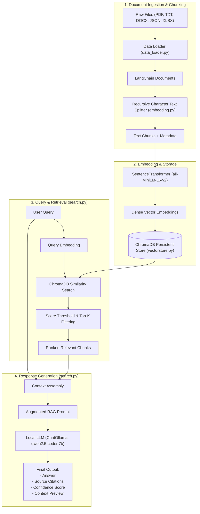

# 📚 Modular Local RAG Pipeline

A modular, production-ready **Retrieval-Augmented Generation (RAG)** pipeline built with **LangChain**, **ChromaDB**, **Sentence-Transformers**, and **Ollama** for private, local LLM question answering over documents.


---

## 🌟 Key Features

- **Multi-Format Ingestion**: Load PDF, TXT, DOCX, JSON, and Excel spreadsheets automatically using LangChain document loaders.
- **Intelligent Chunking**: Splits documents using `RecursiveCharacterTextSplitter` with configurable chunk sizes and overlap to preserve semantic context.
- **Local Dense Embeddings**: Embeds chunks using Hugging Face's `SentenceTransformer` (`all-MiniLM-L6-v2` by default) with zero external API fees.
- **Persistent Vector Store**: Indexes and stores embeddings in **ChromaDB** with persistent disk caching.
- **Precision Retrieval**: Cosine similarity scoring (`1.0 - distance`), configurable rank limit (`top_k`), and score threshold filtering.
- **Local LLM Generation**: Integrates with **Ollama** (e.g., `qwen2.5-coder:7b`, `llama3.2`, or `mistral`) for 100% offline, privacy-first inference.
- **Dual Pipeline Modes**:
  - **Simple RAG**: Prompt augmentation and direct answer generation.
  - **Advanced RAG**: Returns answer, source citations (source file, page, snippet preview), confidence metric, and optional context.
- **Modular Codebase**: Clean, decoupled components ready for extension or integration into web applications (FastAPI/Streamlit).

---

## 🏗️ Architecture & Pipeline Flow

The pipeline consists of two stages: **Offline Indexing** and **Online Query & Retrieval**:



---

## 📁 Repository Structure

```text
RAG/
├── data/                         # Source documents (PDF, TXT, DOCX, JSON, etc.)
│   └── R22_B.Tech._CSE(AIML).pdf
├── notebook/                     # Prototyping & experimentation
│   └── RAG_implementation.ipynb  # Step-by-step Jupyter notebook implementation
├── src/                          # Modular core package
│   ├── __init__.py
│   ├── data_loader.py            # Multi-file document ingestion
│   ├── embedding.py              # Chunking and embedding generation
│   ├── vectorstore.py            # ChromaDB management & querying
│   └── search.py                 # Retrieval & LLM response generation
├── vectorstore/                  # Persistent ChromaDB storage (generated)
├── app.py                        # Example script & application entry point
├── pyproject.toml                # Project metadata & uv dependencies
├── requirements.txt              # Pip dependencies
└── README.md
```

---

## 🚀 Getting Started

### 1. Prerequisites

- **Python**: 3.10 or higher
- **Ollama**: Download and install from [ollama.com](https://ollama.com)

Pull the default language model:
```bash
ollama run qwen2.5-coder:7b
```
*(You can also use `llama3.2`, `mistral`, or any other Ollama model by configuring the model name).*

---

### 2. Installation

Clone this repository and create a virtual environment:

```bash
git clone https://github.com/your-username/RAG.git
cd RAG
```

#### Using `venv` & `pip`:
```bash
python -m venv .venv

# On Windows:
.venv\Scripts\activate
# On Linux/macOS:
source .venv/bin/activate

pip install -r requirements.txt
```

#### Using `uv`:
```bash
uv sync
```

---

### 3. Adding Documents

Place your files (PDF, TXT, JSON, DOCX, or Excel) inside the `data/` directory:

```text
data/
├── my_document.pdf
└── notes.txt
```

---

## 💻 Usage

### Run Quick Demo / CLI

Execute the command line interface in [app.py](file:///c:/Users/unive/OneDrive/Documents/projects/RAG/app.py):

```bash
# Run with default query
python app.py

# Ask a custom question
python app.py "What is Demand and Supply Analysis?"

# With custom parameters
python app.py "Explain Financial Accounting" --min-score 0.15 --model qwen2.5-coder:7b --return-context
```

---

### Using as a Python Module

```python
from src.embedding import EmbeddingPipeline
from src.vectorstore import VectorStore
from src.search import RAGSearch

# 1. Initialize Embedding Pipeline (chunking & embeddings)
embedding_pipeline = EmbeddingPipeline(
    model_name="all-MiniLM-L6-v2",
    chunk_size=1000,
    chunk_overlap=200
)

# 2. Initialize Vector Store (indexes data/ folder automatically)
vector_store = VectorStore(
    embedding_pipeline=embedding_pipeline,
    persist_directory="vectorstore"
)

# 3. Initialize RAG Search with Ollama
rag_search = RAGSearch(
    vector_store=vector_store,
    model_name="qwen2.5-coder:7b",
    temperature=0.5
)

# --- Option A: Fast Retrieval Only ---
chunks = rag_search.retrieve("What is Business Economics?", top_k=3, score_threshold=0.2)
for chunk in chunks:
    print(f"Rank {chunk['rank']} | Score: {chunk['similarity_score']:.4f}")
    print(chunk['document'][:150], "...\n")

# --- Option B: Simple RAG Generation ---
answer = rag_search.rag_simple("Summarize the syllabus of Business Economics.")
print("Answer:\n", answer)

# --- Option C: Advanced RAG with Citations & Confidence ---
result = rag_search.rag_advanced(
    query="Summarize the syllabus of Business Economics.",
    min_score=0.2,
    return_context=True
)

print("Answer:", result["answer"])
print("Confidence:", result["confidence"])
print("Sources:", result["sources"])
```

---

## ⚙️ Configuration Reference

| Parameter | Default | Location | Description |
| :--- | :--- | :--- | :--- |
| `model_name` (embedding) | `all-MiniLM-L6-v2` | `EmbeddingPipeline` | Hugging Face embedding model |
| `chunk_size` | `1000` | `EmbeddingPipeline` | Maximum characters per chunk |
| `chunk_overlap` | `200` | `EmbeddingPipeline` | Character overlap between chunks |
| `persist_directory` | `vectorstore` | `VectorStore` | Local directory for ChromaDB storage |
| `model_name` (LLM) | `qwen2.5-coder:7b` | `RAGSearch` | Local model running in Ollama |
| `temperature` | `0.5` | `RAGSearch` | Generation randomness (0 = deterministic) |
| `score_threshold` | `0.0` / `0.2` | `retrieve` / `rag_advanced` | Minimum cosine similarity score |
| `top_k` | `5` / `15` | `retrieve` / `search` | Max chunks retrieved for synthesis |

---

## 🧪 Interactive Notebook

To explore the development and experiments behind each stage of the pipeline:

```bash
jupyter notebook notebook/RAG_implementation.ipynb
```

The notebook details:
1. Document loading & text inspection
2. Chunking strategies and token length evaluation
3. Dense vector embeddings creation
4. ChromaDB collection querying & similarity scoring
5. Prompt engineering & Ollama response evaluation

---

## 🛠️ Tech Stack

- **Framework**: [LangChain](https://github.com/langchain-ai/langchain)
- **Vector Database**: [ChromaDB](https://www.trychroma.com/)
- **Embeddings**: [Sentence-Transformers](https://sbert.net/)
- **Local Inference**: [Ollama](https://ollama.com/) & [langchain-ollama](https://github.com/langchain-ai/langchain-ollama)
- **PDF & Document Parsing**: [PyMuPDF](https://github.com/pymupdf/PyMuPDF), [pypdf](https://github.com/py-pdf/pypdf), [Unstructured](https://github.com/Unstructured-IO/unstructured)

---

## 📄 License

This project is licensed under the [MIT License](LICENSE).
